# PatentConnect
Compsci 2XB3 project
**Requires Java 11 or greater.**

## Overview

PatentConnect is a Java application that allows everyone from the intellectual-property 
(IP) curious to patent holders to get a better understanding of the relationship 
between patents, while simultaneously providing pertinent information about them. 
Discover more about specific patents, and see the interrelationships between 
patents through visualizations of their connections. 

## Usage
Find a patent (number) of interest from the 
[Patent citation network](https://snap.stanford.edu/data/cit-Patents.html) (PCN) 
and input it into the first input field. If your patent number is wrong, you 
will get an error status identifying the issue. If the patent number is correct, 
it will pull information about the patent from the Google Patents API, and 
present a second input field, where you can enter a second patent. If your second 
search is successful, you will be presented with a graph showing the shortest
citation-connected path between your first patent and the second, if the path exists. 
Click on any patent node in the shortest path to retrieve information about it from the 
Google Patent API. You can also drag and drop nodes in the graph for the 
purpose of rearranging them visually.

## Examples

Note that red boxes represent clickable links, and blue boxes represent
clickable text that prompts an explanation box in the program.

Let's use the shortest path between patents 6009541 and 3854125. The greater number
is the starting patent which cites possible intermediate patents which in turn cite
the ending patent. Let a -> b represent that a cites b. Then,

6009541 -> ??? -> 3854125

Let's take a look at the startup interface.

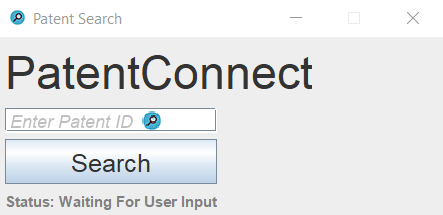

You start by entering your PCN patent ID in the search bar, or click the text
in the red box to visit our GitLab page.

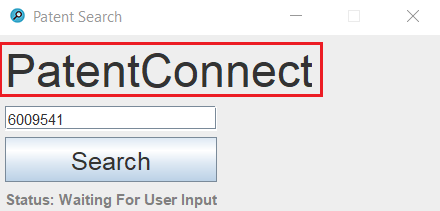

If you click on "PatentConnect" you receive this prompt.

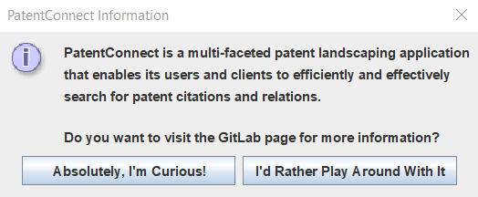

If you accept, you'll be reminded to sign into GitLab.

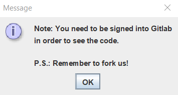

You'll be able to see the GitLab page if you've signed in.

If you choose not to visit our GitLab project page and just want to enter a
patent, assuming your patent is in the PCN, you'll see the following status
after you hit the search button. 

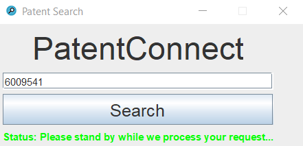

You then get to see relevant details about the patent.

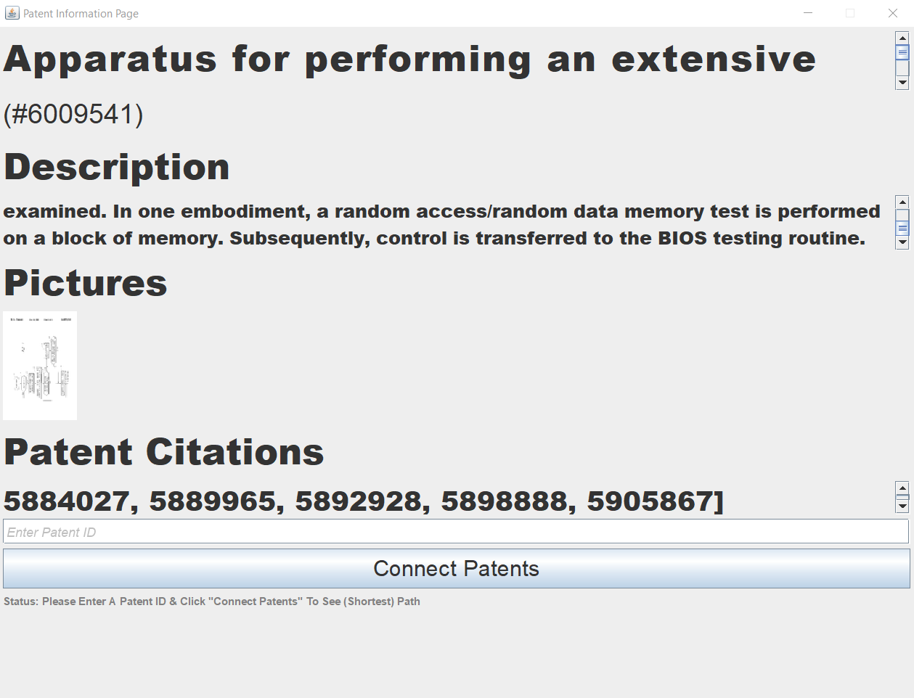

You can click on the blue boxes for clarification on what the sections represent.
You can click on the red boxes to view the patent page (#xxxxxx) or scroll 
through available patent images and click to expand them
. Finally, you can enter a second patent to see if there exists a shortest path 
between these two patents.

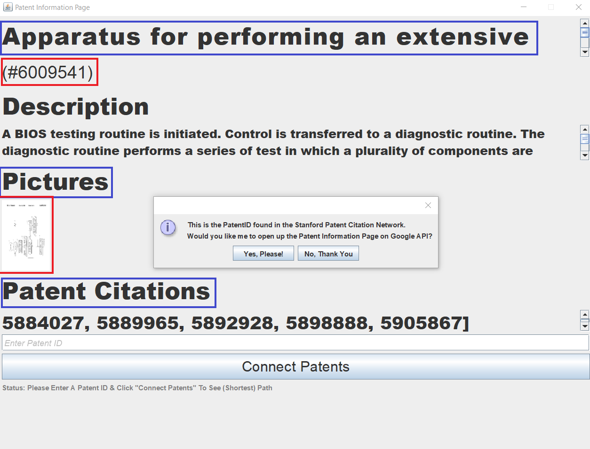

If you click on (#xxxxxx) you'll be brought to the patent page on Google Patents.

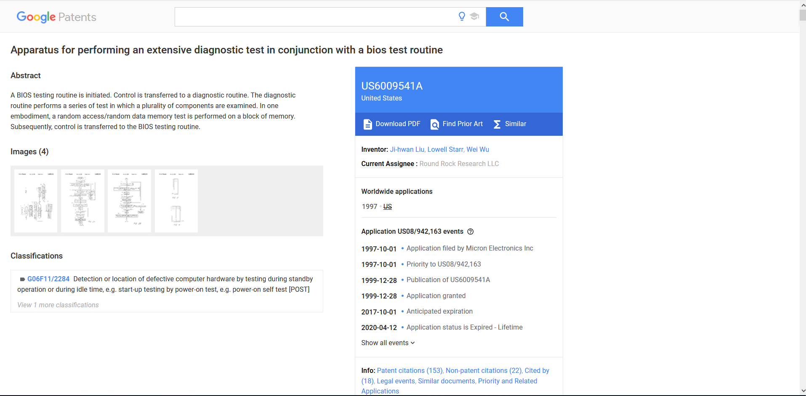

When you enter a second PCN ID you will see the shortest path from the
first patent to the second (i.e. your first patent cites a number
of intermediate patents which eventually cite the second patent). The arrows
represent a "cites" relation.

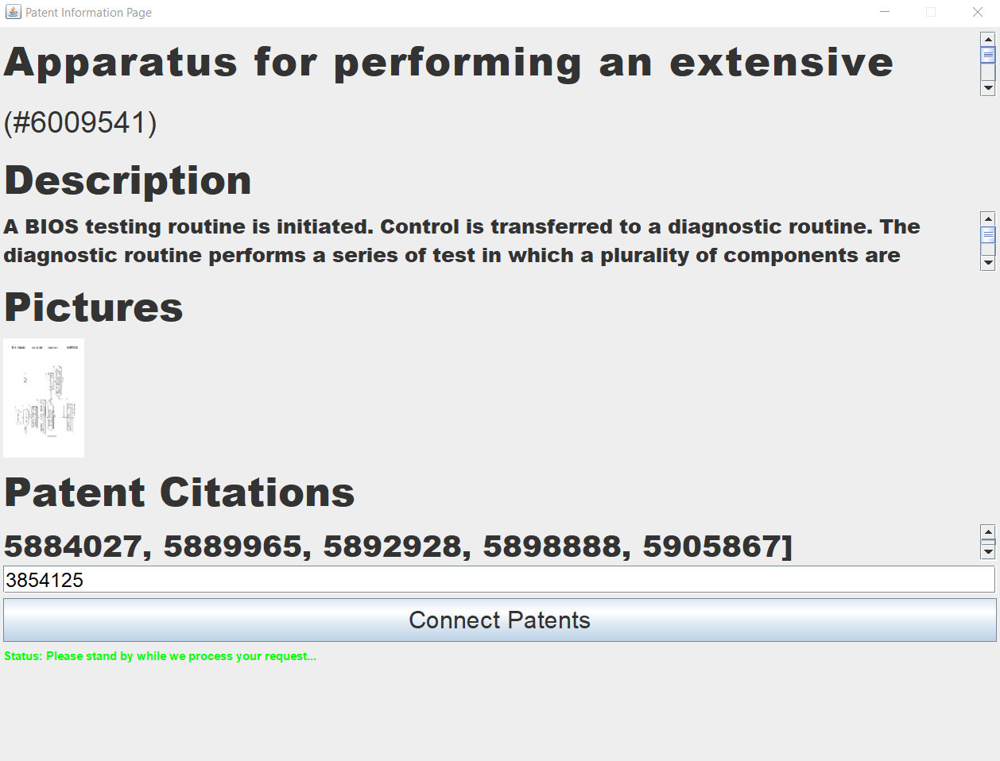

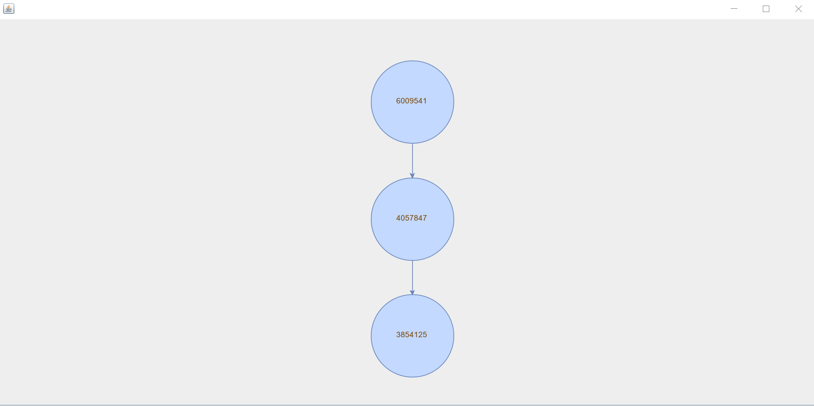

You can click on one of these nodes in the graph to pull up another window 
containing relevant details about that specific patent. You can also recursively
search for other shortest paths starting from your clicked-on node. 

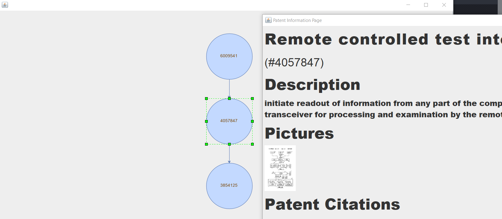

You can also drag the nodes around for your convenience.

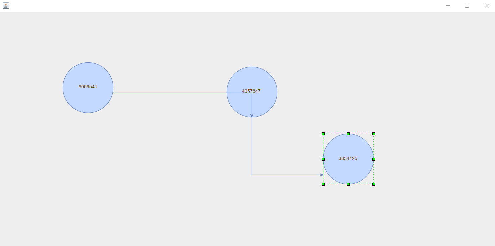

And here is an example of a perfectly legit patent, except with sparse details
provided on the patent's page itself. The placeholders are visible below.

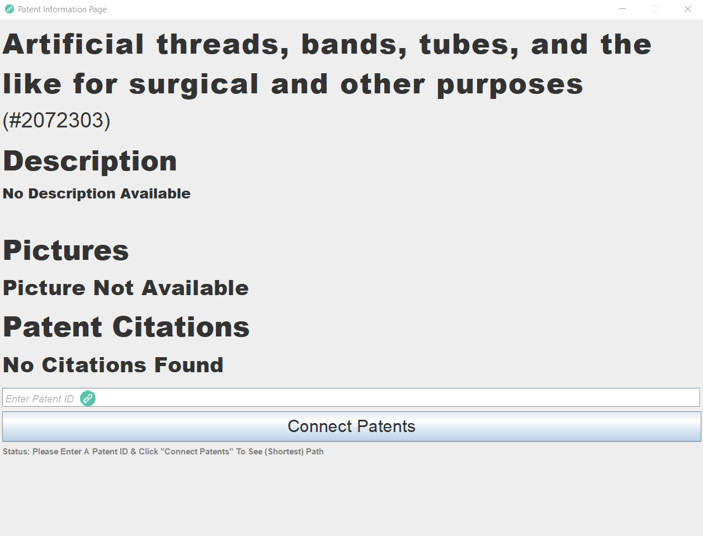

